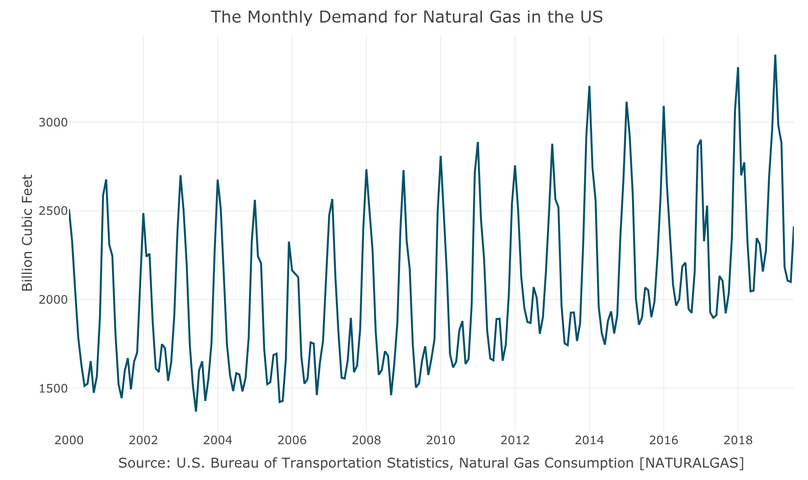
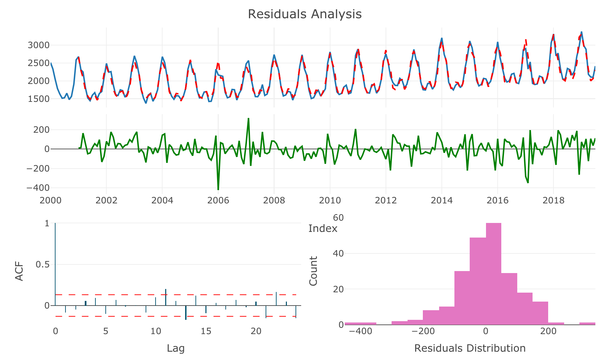
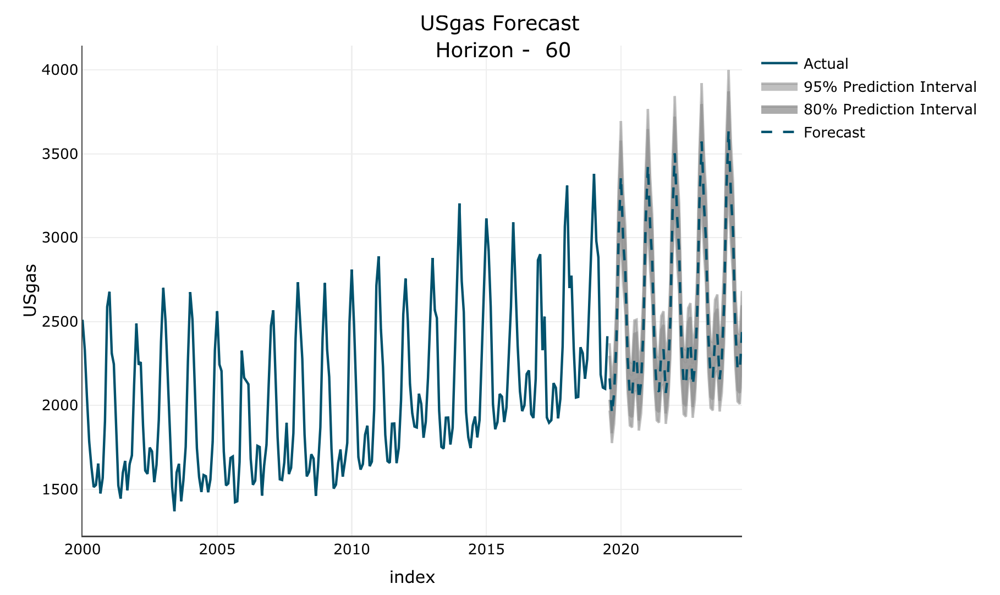

# forecastLM

<!-- badges: start -->
[](https://www.tidyverse.org/lifecycle/#experimental)
[](https://cran.r-project.org/package=forecastLM)
[](https://opensource.org/licenses/MIT)
<!-- badges: end -->

The forecastLM R package provides a framework for forecasting regular time-series data with linear regression models (based on the lm function). It supports both `tsibble` and `ts` objects as an input.

## Installation

Currently, the package available only on Github version:

``` r
remotes::install_github("RamiKrispin/USgrid")
```

## Examples

Forecasting the monthly demand for natural gas in the US:

``` r
# Loading the data from the TSstudio package
library(TSstudio)
data("USgas")

ts_plot(USgas, 
        title = "The Monthly Demand for Natural Gas in the US",
        Ytitle = "Billion Cubic Feet",
        Xtitle = "Source: U.S. Bureau of Transportation Statistics, Natural Gas Consumption [NATURALGAS]",
        Ygrid = TRUE,
        Xgrid = TRUE)
```




Train a forecasting model using the following features:

* Linear trend
* Monthly seasonality
* First and seasonal lags
* Applying log transformation to the series
* Using stepwise function for variables selection

``` r
md <- trainLM(input = USgas,
              trend = list(linear = TRUE),
              seasonal = "month",
              lags = c(1, 12),
              scale = "log",
              step = TRUE)
```

``` 
Start:  AIC=-1364.47
USgas_log ~ month + linear_trend + lag_scale1 + lag_scale12

               Df Sum of Sq      RSS      AIC
<none>                      0.429104 -1364.47
- lag_scale12   1  0.009246 0.438350 -1361.72
- linear_trend  1  0.051063 0.480167 -1341.40
- lag_scale1    1  0.214653 0.643757 -1276.02
- month        11  0.414224 0.843328 -1235.80
```


The function returns a list contains the model, fitted values, residuals, the input series, and the model parameters. The output of the model can be view with the `summary` function:

```r
summary(md$model)
```


```
Call:
stats::lm(formula = USgas_log ~ month + linear_trend + lag_scale1 + 
    lag_scale12, data = df1)

Residuals:
       Min         1Q     Median         3Q        Max 
-0.1780124 -0.0271743  0.0032667  0.0289653  0.1326663 

Coefficients:
                 Estimate   Std. Error  t value              Pr(>|t|)    
(Intercept)   2.364276205  0.483252934   4.8924 0.0000019928131084291 ***
monthFeb     -0.160975117  0.018005811  -8.9402 < 0.00000000000000022 ***
monthMar     -0.157537232  0.018236682  -8.6385 0.0000000000000015098 ***
monthApr     -0.303900547  0.026042009 -11.6696 < 0.00000000000000022 ***
monthMay     -0.269698541  0.030854197  -8.7411 0.0000000000000007785 ***
monthJun     -0.218092057  0.032846111  -6.6398 0.0000000002685697600 ***
monthJul     -0.124514577  0.030023305  -4.1473 0.0000490062229759277 ***
monthAug     -0.174574992  0.027789358  -6.2821 0.0000000019230157294 ***
monthSep     -0.283986218  0.032314991  -8.7881 0.0000000000000005741 ***
monthOct     -0.169093896  0.032157724  -5.2583 0.0000003599125220358 ***
monthNov     -0.084251796  0.026972913  -3.1236              0.002041 ** 
monthDec      0.039490453  0.019470147   2.0283              0.043809 *  
linear_trend  0.000479294  0.000096339   4.9751 0.0000013640958743227 ***
lag_scale1    0.580062379  0.056866457  10.2004 < 0.00000000000000022 ***
lag_scale12   0.122618715  0.057919282   2.1171              0.035443 *  
---
Signif. codes:  0 ‘***’ 0.001 ‘**’ 0.01 ‘*’ 0.05 ‘.’ 0.1 ‘ ’ 1

Residual standard error: 0.04542 on 208 degrees of freedom
Multiple R-squared:  0.95466,	Adjusted R-squared:  0.95161 
F-statistic: 312.84 on 14 and 208 DF,  p-value: < 0.000000000000000222
```


The `plot_res` returns the residuals plot, including the following components:

* Actuals vs. fitted
* The corresponding residuals
* Residuals correlation (ACF)
* Residuals distribution


``` r
plot_res(md)
```



The `forecastLM` function forecast the future observation of the input object, and the `plot_fc` returns a plot of the forecast: 

```
fc <- forecastLM(md, h = 60)

plot_fc(fc)
```


